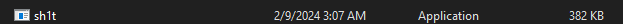

# CHANGELOGS

- **OBS: This demo is using old version (3.0)**
<a target="_blank" href="https://streamable.com/g937bg">Watch the demo</a>

 - Screenshot **project** running on 4.5 - VERSION 

- Screenshot **project** running on 5 - VERSION 

- Screenshot **project** running on 5.5 - VERSION 

- Process  **running**, very low memory usage.

- Total **binary** size 

# 5.5

- [x] Improved performance issues
- [x] Fixed String crash
- [x] Improved rendering methods
- [x] Rendering based on distance

# 6.0

- [x] Grenade Warning **(Molly** and **Frag)**
- [x] Anti-OBS

