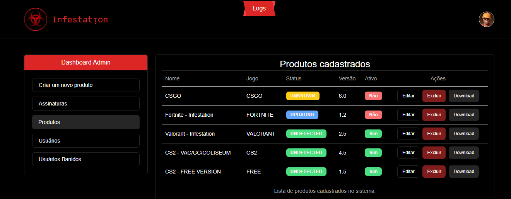

# CS2 - FREE GAMING CHAIR (REUPLOAD)

Feel free to use and modify the project as you wish, but please give credit to the original author.

## TL;DR

**This is a FREE project, if you want a PAID version discord or website**

- [x] Latest CS2 updates
- [x] Free version only works on VAC

- Currently we only support Windows 10 x64 20H2, 21H1 , 22H2.
- VALORANT AND CS2 - PRIVATE GAMING CHAIRS

<a href = "https://www.infestation.com.br">What are you waiting for?</a>

# CS2 (MM AND LEAGUE) - PRIVATE CHEAT

- AIMBOT
- ESP

# VALORANT - PRIVATE CHEAT

- AIMBOT
- ESP

Join our discord server for support and updates on our products.

# [FREE] - Features
Kernel mode / user mode
- [x] Aimbot
- [x] ESP

 
Project with basic features and low performance impact.

3.5 - **NEW VERSION** - 2023-12-27

<a target="_blank" href="https://streamable.com/g937bg">Watch the demo</a>

The driver can be used in any windows 10/11 versions.

- [x] Kernel fully recoded with extra addons
- [x] kernel **mouse_movement** 
- [x] Kernel **mouse_down** and **mouse_up** 
- [x] Kernel manual mapping  
- [ ] Kernel IO **Write Process Memory** (not needed, implement yourself if you want)

## How to use ?
### 1.1
- Download the latest release from [here](https://www.infestation.com.br)

### 1.2

- Clone the repository
- Open the solution in Visual Studio 2022 v143
- **DISABLE** `Security Check` if loading driver with driver mapper

- Build the project
- Copy the driver to the same folder as the executable
- Load the driver manually with services or driver mapper
- Run the executable
- Press `HOME` to toggle the Menu

## Disclaimer

I wont support or provide any binaries for this project, you are free to use it as you wish, this is a free project.

