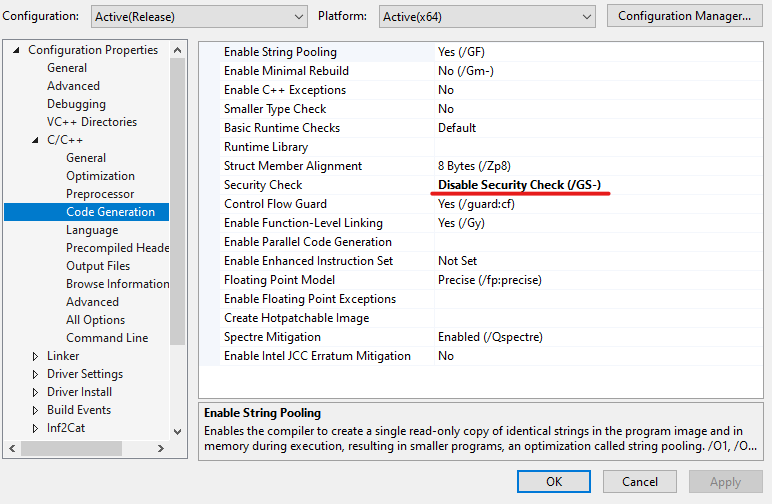

# CS2 - FREE GAMING CHAIR 

Project with awesome features and low performance impact.

## Usermode

- Screenshot **project** running on 4.5 - VERSION 

- Process  **running**, very low memory usage.

- Total **binary** size 

- **OBS: This demo is using old version (3.0)**
<a target="_blank" href="https://streamable.com/g937bg">Watch the demo</a>

### Features (4.5)

- Mouse
- [x] Aimbot
- [ ] Triggerbot
- [ ] RCS

- ESP
- [x] Player **(Box, Skeleton,Name, Distance, SnapLines, Health)**

- WORLD
- [x] Weapon **(Name, Distance, SnapLines)**
- [x] Grenade **(Trajectory, Name, Distance, Timer)**

- MISC
- [x] Team-Check
- [ ] Anti-Screencapture
- [ ] Radar
- [ ] Bunny-hop
- [ ] Sound-ESP
- [ ] Bomb-Timer

- Config
- [ ] Create
- [ ] Load
- [ ] Delete

## Driver
The driver can be used in any windows 10/11 versions.

- [x] Kernel fully recoded with extra addons
- [x] kernel **mouse_movement** 
- [x] Kernel **mouse_down** and **mouse_up** 
- [x] Kernel manual mapping  
- [ ] Kernel IO **Write Process Memory** (not needed, implement yourself if you want)

## How to use ?
### 1.1
- Download the latest release from [here](https://www.infestation.com.br)

### 1.2

- Clone the repository
- Open the solution in Visual Studio 2022 v143
- **DISABLE** `Security Check` if loading driver with driver mapper

- Build the project
- Copy the driver to the same folder as the executable
- Load the driver manually with services or driver mapper
- Run the executable
- Press `HOME` to toggle the Menu

## Disclaimer

I wont support or provide any binaries for this project, you are free to use it as you wish, this is a free project.

